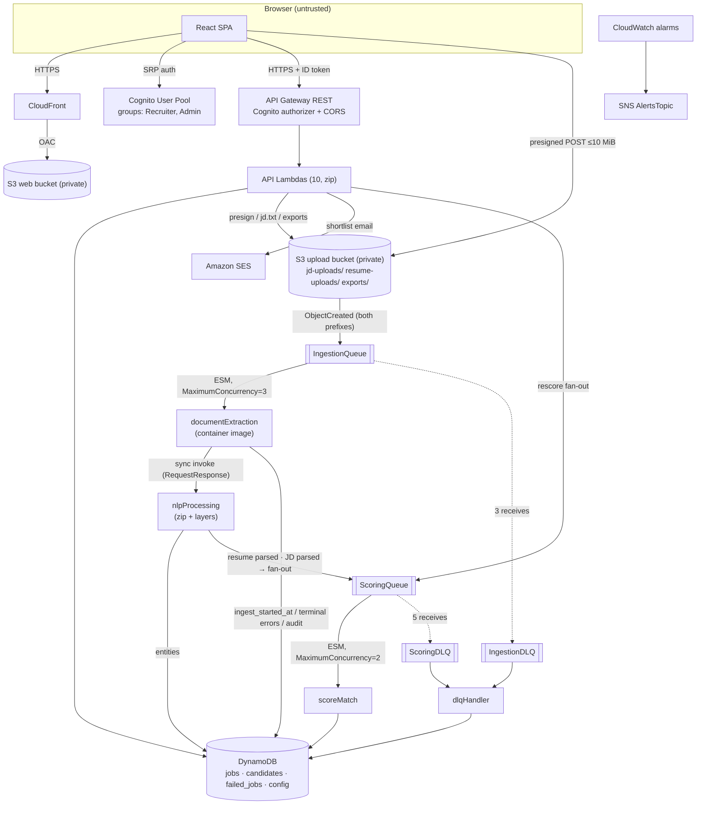
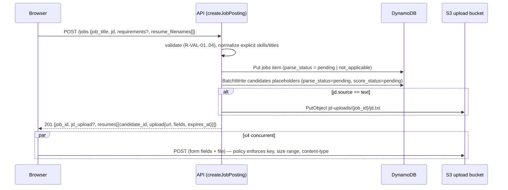

# Architecture — AI-Powered Resume Screener

> **Scope:** how the system is structured and why. This file is the authoritative *structure*. Reference code lives in phase files `01`–`05`, and build/run/debug workflows in `Implementation.md`. **Δ** marks a change from the original (pre-2026-09-23) design; `Memory.md` §7 lists every such change and why. Decision IDs (D-xx) are defined in `Memory.md` §3; rule IDs (R-xx) in `Rules.md`.

---

## 1. High-Level Architecture



**Style:** serverless and event-driven. There are two asynchronous stages (ingestion, scoring), each behind SQS with its own DLQ, plus a synchronous REST API for the recruiter. There are no servers, no VPC, and no NAT: every service is reached over AWS public endpoints with IAM auth, which is simplest and costs nothing at idle.

## 2. Components & Responsibilities

| Component | Type | Responsibility | Must NOT |
|---|---|---|---|
| React SPA | Static site via CloudFront | UI, Cognito sign-in, direct uploads, polling | Hold business logic that the API doesn't also enforce |
| API Gateway | REST, Cognito authorizer | Token validation, CORS, throttling (20 rps / burst 40), request size limits | Route-level group checks (done in Lambda) |
| `createJobPosting` | Lambda zip | Validate, create job + candidate placeholders, issue presigned POSTs, write `jd.txt` for pasted JDs | Accept file bytes |
| `addResumes` **Δ new** | Lambda zip | Add candidates to an existing job, issue presigned POSTs | — |
| `getJobs` | Lambda zip | List the caller's jobs (`RecruiterJobsIndex`) or all jobs (Admin) | Scan without pagination |
| `getJob` **Δ new** | Lambda zip | Job detail incl. effective requirements + `blocking_reason` | — |
| `updateJob` **Δ new** | Lambda zip | Edit requirements/threshold; set `requirements_confirmed`; fan out rescoring | Touch decisions |
| `getCandidatesByJob` | Lambda zip | Base-table Query, compute `display_status`, sort | Use `JobScoreIndex` (removed, D-16) |
| `updateCandidateDecision` | Lambda zip | Decision write + at-most-once SES email | Fail the decision because email failed |
| `getResumeUrl` **Δ new (S)** | Lambda zip | 60 s presigned GET for the original file after an ownership check | — |
| `exportShortlistCsv` | Lambda zip | CSV of `decision=shortlisted`, formula-escaped, presigned GET 5 min | — |
| `getFailedJobs` | Lambda zip | Admin-only audit listing | — |
| `documentExtraction` | Lambda image | Download, validate magic bytes/limits, extract text (native/DOCX/OCR per page), invoke NLP, own ingestion failure recording | Understand entities; read dictionaries |
| `nlpProcessing` | Lambda zip + `CommonLayer` + `NlpLayer` | spaCy NER + PhraseMatcher + experience; write entities; enqueue scoring; JD fan-out | Write `failed_jobs` (D-20); overwrite explicit requirements |
| `scoreMatch` | Lambda zip + `CommonLayer` | Pure scoring + explanation, conditional write | Retry on "JD not ready" (D-18); read identity fields |
| `dlqHandler` | Lambda zip | Terminal audit row + conditional status → `error` | Overwrite a `parsed`/`scored` item |
| `CommonLayer` | Zip layer | `normalization`, dictionaries, `title_families`, `requirements`, `status`, `errors`, `ddb` (Decimal), `log`, `ids`, `clock` | Depend on spaCy |
| `NlpLayer` | Zip layer | spaCy, `en_core_web_sm`, `python-dateutil` | — |

**Why one Lambda per route:** it keeps least-privilege IAM per route (e.g. only `updateCandidateDecision` can send email). The cost is more template boilerplate, which a SAM `Globals` section absorbs.

## 3. Data Flow

### 3.1 Create & upload



Server-chosen keys (D-21): `jd-uploads/{job_id}/jd.{ext}` and `resume-uploads/{job_id}/{candidate_id}/resume.{ext}`. The user's filename is stored only as `original_filename`, and never becomes part of an S3 key or a `/tmp` path.

### 3.2 Ingestion (extraction → NLP)

```mermaid
sequenceDiagram
    participant Q as IngestionQueue
    participant E as documentExtraction
    participant D as DynamoDB
    participant N as nlpProcessing
    participant SQ as ScoringQueue
    Q->>E: S3 event (BatchSize 1)
    E->>E: unquote_plus(key); parse prefix → doc_type, job_id, candidate_id
    E->>D: UpdateItem ingest_started_at = if_not_exists(now)  [cond: item exists]
    E->>E: download to /tmp/{uuid}/; check size, magic bytes, page count
    E->>E: per page: native text; if < 40 chars → render 200 dpi + Tesseract
    alt terminal error (unsupported/unreadable/too_many_pages/missing placeholder)
        E->>D: Put failed_jobs (terminal=true); Update status=error, error_code  [cond: not parsed]
        E-->>Q: success (ack) — no retry
    else transient error
        E->>D: Put failed_jobs (terminal=false, retry_count)
        E-->>Q: raise → redelivered after visibility timeout
    else ok
        E->>N: invoke {doc_type, job_id, candidate_id, extracted_text, extraction_metadata}
        N->>N: nlp(text) once; entities; PhraseMatcher; experience
        alt resume
            N->>D: Update candidate entities, parse_status=parsed  [cond: exists]
            N->>SQ: {job_id, candidate_id, reason: candidate_parsed}
        else jd
            N->>D: Update job derived_* , parse_status=parsed
            N->>D: Query candidates(job_id) ConsistentRead, parse_status=parsed
            N->>SQ: SendMessageBatch {reason: job_ready} × n
        end
        N-->>E: {status: parsed} or FunctionError{errorType}
        E->>E: FunctionError → classify by errorType → terminal/transient path above
    end
    E->>E: finally: rm -rf /tmp/{uuid}
```

The extraction/NLP boundary contract (payload in `Implementation.md` §4.2) is the same as the original design, plus `extraction_metadata.page_count`, `ocr_pages`, and `text_truncated`.

### 3.3 Scoring & readiness (D-18)

`scoreMatch(job_id, candidate_id)`:
1. `GetItem` job and candidate with `ConsistentRead=True`.
2. If the candidate is not `parsed` → log `skip_not_parsed`, **ack**.
3. If `!scorable(job)` (§7.1) → log `skip_job_not_scorable`, **ack**. Scoring will be re-triggered by the JD-parsed fan-out or by `PATCH /jobs/{id}`.
4. Compute sub-scores, match score, explanation (§7.3) → `UpdateItem` with condition `parse_status = parsed`; set `score_status=scored`.
5. An unexpected exception → `failed_jobs` (`stage=scoring`), re-raise → SQS retries up to 5 → `ScoringDLQ` → `dlqHandler` sets `score_status=error`.

**Why this is race-free:** a candidate's `parsed` write happens before it enqueues itself. The JD's `parsed` write happens before the fan-out query, and that query uses `ConsistentRead`. So if `scoreMatch` saw the JD as not ready, the fan-out query necessarily runs later and sees the candidate as `parsed`. At worst, a candidate is scored twice, and scoring is idempotent.

**What it replaces:** the original design raised "JD not parsed yet" so SQS would retry, with 5 × 60 s ≈ 5 min of attempts. A JD that needs even one transient ingestion retry (720 s visibility) would push every resume into `scoring_exhausted`, even though nothing was wrong with them.

### 3.4 Decision & email

```
POST /jobs/{job_id}/candidates/{candidate_id}/decision {decision}
 1. authorize: group ∈ {Recruiter, Admin}; job.recruiter_id == sub or Admin   (else 404)
 2. UpdateItem decision, decided_by, decided_at   [cond: score_status = scored]   (else 409 NOT_SCORED)
 3. if decision == shortlisted:
      if no email → notification_status = skipped_no_email
      else UpdateItem notification_status = sending
             [cond: attribute_not_exists(notification_status) OR notification_status IN (failed)]
           → if the condition fails: already sent/sending → no email
           → ses.send_email(Source = env SES_SENDER_ADDRESS)
           → notification_status = sent, notification_sent_at  |  failed (+ log, failed_jobs stage=api)
 4. 200 {decision, notification_status}
```

Email is at-most-once (R-BUS-07). A crash between `sending` and `sent` leaves `sending`, which the UI shows as "Email status unknown". This is accepted, because a duplicate email is worse than an unknown status.

### 3.5 Failure path summary

See §11.3 for the full matrix. Terminal problems are recorded once and surfaced immediately. Transient problems retry through SQS and, once exhausted, `dlqHandler` makes them terminal.

## 4. Interfaces & Contracts

| Contract | Definition |
|---|---|
| S3 event → IngestionQueue | Raw S3 event JSON (`Implementation.md` §4.1). **Keys are URL-encoded** — always `urllib.parse.unquote_plus` |
| Extraction → NLP payload | `Implementation.md` §4.2 (includes `page_count`, `ocr_pages`). `extracted_text` is capped at 100,000 chars (`text_truncated: true` flag) |
| NLP → Extraction error | Lambda `FunctionError` with `errorType`: `EmptyDocumentError` (terminal → `unreadable_document`), `OrphanRecordError` (terminal → stage `orphan_object`, no status write), anything else (transient, stage `nlp`) |
| ScoringQueue message | `{"job_id", "candidate_id", "reason": "candidate_parsed" \| "job_ready" \| "requirements_changed"}` — `reason` is for logs only; scoring behaviour never branches on it |
| NLP invoke client | `botocore.Config(read_timeout=40, connect_timeout=5, retries={"max_attempts": 0})` — a client-side retry would run NLP twice (D-43) |

## 5. API

All routes: Cognito authorizer (raw ID token in the `Authorization` header, with no `Bearer ` prefix; D-47), CORS enabled, JSON bodies. Every handler first runs the shared `authorize(event, job_id?)` from `CommonLayer` (R-AUTH-01..04).

| Method | Path | Handler | Notes |
|---|---|---|---|
| POST | `/jobs` | createJobPosting | Δ `jd` object, presigned **POST** |
| GET | `/jobs` | getJobs | Δ `?next_token=`; Admin sees `recruiter_id` |
| GET | `/jobs/{job_id}` | getJob | **Δ new** |
| PATCH | `/jobs/{job_id}` | updateJob | **Δ new** → rescore fan-out |
| POST | `/jobs/{job_id}/resumes` | addResumes | **Δ new** |
| GET | `/jobs/{job_id}/candidates` | getCandidatesByJob | Δ returns all rows with `display_status` |
| POST | `/jobs/{job_id}/candidates/{candidate_id}/decision` | updateCandidateDecision | Δ `pending` allowed; returns `notification_status` |
| GET | `/jobs/{job_id}/candidates/{candidate_id}/resume-url` | getResumeUrl | **Δ new, S priority, OQ8** |
| GET | `/jobs/{job_id}/export` | exportShortlistCsv | returns `row_count` |
| GET | `/failed-jobs` | getFailedJobs | Admin; `?job_id=&next_token=` |

### 5.1 Key shapes (export, failures, and job-list shapes are specified in `03` §6)

```jsonc
// POST /jobs — request
{
  "job_title": "Backend Engineer",                         // 1–200 chars
  "jd": { "source": "file", "filename": "jd.pdf" },         // or {"source":"text","text":"..."} (≤50k chars) or {"source":"none"}
  "required_skills": ["python", "aws"],                     // optional; ≤50 items; required if jd.source = none
  "required_titles": ["backend engineer"],                  // optional; ≤20 items
  "min_experience_years": 3,                                // optional; 0–50
  "shortlist_threshold": 70,                                // optional; 0–100, default 70
  "resume_filenames": ["a.pdf", "b.docx"]                   // optional; ≤50; allowlisted extensions
}
// POST /jobs — 201
{
  "job_id": "job_3f9c…",
  "jd_upload": { "url": "https://…s3…", "fields": { "key": "…", "policy": "…", "…": "…" }, "expires_at": "2026-09-23T10:15:00Z" },
  "resumes": [ { "candidate_id": "cand_8a1e…", "filename": "a.pdf", "upload": { "url": "…", "fields": { }, "expires_at": "…" } } ]
}

// GET /jobs/{job_id} — 200
{
  "job_id": "job_3f9c…", "job_title": "Backend Engineer", "jd_source": "file",
  "parse_status": "parsed", "error_code": null,
  "effective": { "skills": ["aws","dynamodb","python"], "titles": ["backend engineer"], "min_experience_years": 3 },
  "sources":   { "skills": "recruiter", "titles": "jd", "min_experience_years": "recruiter" },
  "derived":   { "skills": ["aws","python","sql"], "titles": ["backend engineer"], "min_experience_years": 2 },
  "shortlist_threshold": 70, "requirements_confirmed": false,
  "scorable": true, "blocking_reason": null,                // awaiting_jd | jd_failed | no_required_skills
  "created_at": "…", "updated_at": "…"
}

// PATCH /jobs/{job_id} — request (any subset); 200 → job object + {"rescore_enqueued": 12}
{ "required_skills": ["python","aws","dynamodb"], "required_titles": [], "min_experience_years": 3, "shortlist_threshold": 65 }

// GET /jobs/{job_id}/candidates — 200 (one element shown)
{
  "job_id": "job_3f9c…",
  "candidates": [{
    "candidate_id": "cand_8a1e…", "original_filename": "jane_doe.pdf",
    "display_status": "scored", "error_code": null,
    "name": "Jane Doe", "email": "jane.doe@example.com",
    "skills": ["aws","python","sql"], "titles_held": ["backend developer"], "employers": ["Acme Corp"],
    "total_experience_years": 4.0, "experience_basis": "computed",   // computed | estimated | unknown
    "match_score": 71.3, "skills_score": 66.7, "title_score": 60, "experience_score": 100,
    "matched_skills": ["aws","python"], "missing_skills": ["dynamodb"],
    "title_match": { "type": "related", "held": "backend developer", "required": "backend engineer" },
    "recommended": true, "decision": "pending", "notification_status": null,
    "file_type": "pdf_native", "updated_at": "…"
  }]
}

// POST …/decision — request / 200
{ "decision": "shortlisted" }           // shortlisted | rejected | pending
{ "candidate_id": "cand_8a1e…", "decision": "shortlisted", "notification_status": "sent" }
```

### 5.2 Errors

Envelope: `{"error": {"code": "VALIDATION_FAILED", "message": "human-readable", "details": [{"field": "resume_filenames[3]", "issue": "unsupported_extension"}]}}`

| HTTP | code | When |
|---|---|---|
| 400 | `VALIDATION_FAILED` | Schema/limit violation |
| 400 | `REQUIREMENTS_REQUIRED` | `jd.source=none` with no skills |
| 400 | `LIMIT_EXCEEDED` | >50 files per request or >200 candidates per job |
| 401 | (API Gateway) | Missing or invalid token — GatewayResponse carries CORS headers |
| 403 | `FORBIDDEN` | No group, or non-Admin calling `/failed-jobs` |
| 404 | `NOT_FOUND` | Job/candidate missing **or not owned by caller** (R-AUTH-04) |
| 409 | `NOT_SCORED` | Decision on a candidate whose `score_status ≠ scored` |
| 500 | `INTERNAL` | Unexpected; `failed_jobs` `stage=api` best-effort; no internals in `message` |

## 6. Storage & Data Models

All tables are `PAY_PER_REQUEST`, with point-in-time recovery **off** (cost; demo data) and SSE on by default. Table names reach code **only** through environment variables (D-37).

### 6.1 `jobs` — PK `job_id`
| Attribute | Type | Notes |
|---|---|---|
| `job_id` | S | `job_` + uuid4 hex |
| `recruiter_id` | S | Cognito `sub`; **GSI `RecruiterJobsIndex`** PK Δ |
| `created_at` | S | ISO-8601 UTC `Z`; `RecruiterJobsIndex` SK |
| `job_title` | S | |
| `jd_source` | S | `file` \| `text` \| `none` Δ |
| `jd_s3_key`, `jd_original_filename` | S | Absent when `jd_source=none` |
| `parse_status` | S | `pending` \| `parsed` \| `error` \| `not_applicable` Δ |
| `error_code` | S | Set with `error` |
| `required_skills`, `required_titles` | L | **Explicit** (recruiter), normalized. Attribute absent = not supplied Δ |
| `min_experience_years` | N | Explicit; absent = not supplied |
| `derived_skills`, `derived_titles`, `derived_min_experience_years` | L/L/N | From JD NLP Δ |
| `requirements_confirmed` | BOOL | Set by PATCH; lets a job whose JD failed become scorable Δ |
| `shortlist_threshold` | N | Default 70 |
| `ingest_started_at`, `updated_at` | S | |

### 6.2 `candidates` — PK `job_id`, SK `candidate_id`
| Attribute | Type | Notes |
|---|---|---|
| `candidate_id` | S | `cand_` + uuid4 hex |
| `original_filename` | S | Display only Δ |
| `resume_s3_key` | S | Server-chosen |
| `upload_expires_at`, `ingest_started_at` | S | Drive `upload_missing` / `stalled` Δ |
| `file_type` | S | `pdf_native` \| `pdf_scanned` \| `pdf_mixed` Δ \| `docx` \| `image` |
| `page_count`, `ocr_pages`, `char_count` | N | Δ |
| `parse_status` | S | `pending` \| `parsed` \| `error` — extraction/NLP only |
| `score_status` | S | `pending` \| `scored` \| `error` Δ (D-17) |
| `error_code` | S | Public code (§7.4) |
| `name`, `email` | S | May be absent |
| `employers`, `titles_held`, `skills` | L | Normalized, sorted, deduped |
| `total_experience_years` | N | **Decimal**; **absent = unknown** Δ |
| `experience_estimated` | BOOL | |
| `match_score`, `skills_score`, `title_score`, `experience_score` | N | **Decimal**, 1 dp; **never written as null** |
| `matched_skills`, `missing_skills` | L | Δ |
| `title_match_type`, `title_match_held`, `title_match_required` | S | Δ |
| `shortlist_candidate` | BOOL | API name `recommended` |
| `scoring_version`, `scored_at` | S | `v1` Δ |
| `decision`, `decided_by`, `decided_at` | S | `pending` \| `shortlisted` \| `rejected` |
| `notification_status`, `notification_sent_at` | S | Δ |
| `created_at`, `updated_at` | S | |

**Δ `JobScoreIndex` removed (D-16).** DynamoDB GSIs are sparse: items without `match_score` are not in the index, so querying it hid every pending, error, and unscored candidate, which contradicted FR14a. Writing `match_score = null` would also fail, because an index key cannot be NULL. `getCandidatesByJob` instead runs a paginated base-table `Query(job_id)` (≤200 items per job) and sorts in Lambda.

### 6.3 `failed_jobs` — PK `job_id`, SK `failure_id`
Attributes: `job_id`, `failure_id` (`fail_` + uuid4 hex), `candidate_id` (absent for JD/orphans), `stage`, `error_message`, `retry_count`, `raw_payload` (terminal rows), `created_at`, plus `error_type` (exception class), `terminal` (BOOL), `expires_at` (N, epoch seconds, **TTL 90 days**). `job_id` is `"unknown"` when a key couldn't be parsed. `error_message` is ≤500 chars and PII-free (R-PRIV-02).

### 6.4 `config` — unchanged (`nlp_engine_mode = spacy_hybrid`, read once per cold start; any other value → the NLP function fails to initialize; D-13).

### 6.5 S3
| Bucket | Prefix / key | Lifecycle |
|---|---|---|
| `resume-screener-{env}-{account}` (uploads) | `jd-uploads/{job_id}/jd.{pdf,docx,png,jpg,jpeg,tiff,txt}` | 180 days (OQ9) |
| | `resume-uploads/{job_id}/{candidate_id}/resume.{pdf,docx,png,jpg,jpeg,tiff}` | 180 days (OQ9) |
| | `exports/{job_id}/{yyyymmddThhmmssZ}.csv` | 7 days |
| `resume-screener-web-{env}-{account}` **Δ** | SPA build | none |

Both buckets have Block Public Access (all 4) on, SSE-S3, `BucketOwnerEnforced`, and a bucket policy denying non-TLS (`aws:SecureTransport=false`). The upload bucket's CORS allows `POST` from the CloudFront origin (and `http://localhost:5173` in `dev` only), plus `GET` for presigned downloads.

## 7. State & Derivation Logic (single implementation in `CommonLayer`)

Transition rules are in `Rules.md` §5. This section defines the derived values.

### 7.1 Effective requirements & scorability
```
effective.skills  = required_skills  if present and non-empty else derived_skills  or []
effective.titles  = required_titles  if present              else derived_titles  or []
effective.min_exp = min_experience_years if present          else derived_min_experience_years or 0
scorable(job) = len(effective.skills) ≥ 1
                AND (parse_status ∈ {parsed, not_applicable} OR requirements_confirmed)
blocking_reason = awaiting_jd        if parse_status = pending and not requirements_confirmed
                  jd_failed          if parse_status = error   and not requirements_confirmed
                  no_required_skills if len(effective.skills) = 0
                  null otherwise
```

### 7.2 Candidate `display_status` (evaluated top to bottom)
| # | Condition | display_status |
|---|---|---|
| 1 | `parse_status = error` | `error` |
| 2 | `pending`, no `ingest_started_at`, now > `upload_expires_at` + 2 min | `upload_missing` |
| 3 | `pending`, `ingest_started_at` older than 60 min | `stalled` |
| 4 | `pending` | `processing` |
| 5 | `parsed`, `score_status = error` | `error` (`scoring_failed`) |
| 6 | `parsed`, `score_status = scored` | `scored` |
| 7 | `parsed`, job `blocking_reason = awaiting_jd` | `awaiting_jd` |
| 8 | `parsed`, job not scorable (other reason) | `awaiting_requirements` |
| 9 | `parsed`, job scorable | `scoring` |

Sort order: `scored` by `match_score` desc (tie-break `candidate_id`), then `scoring`, `awaiting_jd`, `awaiting_requirements`, `processing`, `stalled`, `upload_missing`, `error`.

### 7.3 Scoring (Δ corrections to the original formula write-up; version `v1`)
- **Arithmetic:** convert every DynamoDB `Decimal` to `float` for arithmetic, round to 1 dp, and convert back via `Decimal(str(x))` before writing (D-37). The original skeleton divided a float by a Decimal (`TypeError`) and wrote floats (`TypeError` in the boto3 resource API).
- **Skills:** `|C ∩ R| / |R| × 100` over normalized sets; `R` non-empty is guaranteed by scorability. Store `matched_skills = C ∩ R`, `missing_skills = R − C`.
- **Title:** best match across **all** `titles_held` (D-26): exact → 100; same family in `title_families.json` → 60; none → 0. Empty `effective.titles` → 100 (no requirement = met), with `title_match_type = not_required`. The original used `synonyms.json["titles"]`, which maps abbreviations (swe → software engineer), not related roles, so the worked example (backend developer ~ backend engineer = 60) would have scored 0.
- **Experience:** `min(100, years / min_exp × 100)`; `min_exp = 0` → 100; unknown years → 0 with `experience_basis = unknown` shown in the UI.
- **Inputs are limited to** skills, titles_held, and total_experience_years. Name, email, and employers are never read by scoring (R-BUS-09).

### 7.4 Public error codes (recruiter-visible) vs internal stages
| `error_code` | Internal stage(s) | Retried? |
|---|---|---|
| `unsupported_format` | `unsupported_format` | No |
| `file_too_large` | `unsupported_format` | No |
| `too_many_pages` | `pdf_extract` | No |
| `unreadable_document` | `pdf_extract`, `docx_extract`, `ocr`, `nlp` (EmptyDocumentError) | No |
| `processing_failed` | `ingestion_exhausted` (earlier attempts: `s3_download`, `ocr`, `nlp`, …) | After 3 attempts |
| *(none — no item to mark)* | `orphan_object` (key matches no prefix or no placeholder) | No |
| `scoring_failed` | `scoring_exhausted` | After 5 attempts |
| `jd_failed` (job) | any ingestion stage for a JD | per above |

## 8. Security Boundaries

| Zone | Contents | Trust | Controls |
|---|---|---|---|
| Z0 Client | Browser, SPA, tokens in browser storage | Untrusted | All checks repeated server-side |
| Z1 Edge | CloudFront, API Gateway, S3 presigned endpoints | Enforcement | TLS only; Cognito authorizer; CORS allowlist; throttling; POST policy (key, size range, content-type) |
| Z2 Compute | Lambdas | Trusted code, **untrusted document content** | Parsers treat input as hostile: size/page/pixel caps, magic bytes, no macro/JS execution, per-invocation `/tmp` dir, timeouts |
| Z3 Data | DynamoDB, S3, SES | Trusted | Per-function IAM by ARN/prefix; encryption at rest; no public access |

**Authn/authz:** Cognito User Pool with `AllowAdminCreateUserOnly: true` (Δ). A groupless user can still hold a valid token, so every handler requires `Recruiter` or `Admin` from `cognito:groups`. Job-scoped handlers load the job and compare `recruiter_id` to `sub`, returning 404 on mismatch (Δ — the original spec only filtered `GET /jobs`, so any recruiter could read any job's candidates by ID).

**Candidate-controlled data flows** (treat as tainted): → React (escaped by default; never `dangerouslySetInnerHTML`) · → CSV (formula-escaped) · → email body (plain text only; job title comes from the recruiter) · → logs (never).

### 8.1 IAM matrix (Δ supersedes the original matrix)
| Function | DynamoDB | S3 | Other |
|---|---|---|---|
| createJobPosting | jobs Put; candidates BatchWrite; failed_jobs Put | Put `jd-uploads/*`, `resume-uploads/*` | — |
| addResumes | jobs Get; candidates BatchWrite/Query; failed_jobs Put | Put `resume-uploads/*` | — |
| getJobs | jobs Query (`RecruiterJobsIndex`), Scan | — | — |
| getJob | jobs Get | — | — |
| updateJob | jobs Get/Update; candidates Query | — | sqs:SendMessage ScoringQueue |
| getCandidatesByJob | jobs Get; candidates Query | — | — |
| updateCandidateDecision | jobs Get; candidates Get/Update; failed_jobs Put | — | ses:SendEmail (sender identity ARN) |
| getResumeUrl | jobs Get; candidates Get | Get `resume-uploads/*` | — |
| exportShortlistCsv | jobs Get; candidates Query | Put/Get `exports/*` | — |
| getFailedJobs | failed_jobs Query/Scan | — | — |
| documentExtraction | jobs/candidates Update; failed_jobs Put | Get `jd-uploads/*`, `resume-uploads/*` | lambda:InvokeFunction NlpFunction |
| nlpProcessing | jobs Update; candidates Update/Query; config Get | — | sqs:SendMessage ScoringQueue |
| scoreMatch | jobs Get; candidates Get/Update; failed_jobs Put | — | — |
| dlqHandler | jobs/candidates Update; failed_jobs Put | — | none: metrics via Embedded Metric Format on stdout (D-49); `cloudwatch:PutMetricData` with a namespace condition only as a fallback |

Every function also gets its own CloudWatch Logs group (explicit `AWS::Logs::LogGroup`, 30-day retention).

## 9. External Dependencies

| Dependency | Used by | Purpose | Licence / risk |
|---|---|---|---|
| pypdf | extraction | Native PDF text | BSD |
| PyMuPDF (fitz) | extraction | Page count, rasterization | **AGPL** — acceptable for academic use; note in deliverables |
| Tesseract + `eng.traineddata` | extraction | OCR | Apache-2.0; install path risk (D-34) |
| pytesseract, Pillow | extraction | OCR binding, images | Apache / HPND; set `Image.MAX_IMAGE_PIXELS = 50_000_000` |
| python-docx | extraction | DOCX | MIT |
| spaCy 3.x + `en_core_web_sm` | NLP | NER, tokenizer, PhraseMatcher | MIT; layer-size risk (A4) |
| python-dateutil | NLP | Date parsing | BSD/Apache — **must be in `NlpLayer`** (missing from the original layer build) |
| aws-amplify (Auth only) | SPA | Cognito SRP, token refresh | Apache-2.0 |
| React, Vite, React Router | SPA | UI | MIT |

Pin exact versions in `requirements.txt` / `package-lock.json`. Add no other runtime dependencies without an entry in `Memory.md`.

## 10. Deployment & Runtime

- **One SAM stack per environment** (`resume-screener-dev`, `resume-screener-prod`), same account, with `EnvName` suffixing every named resource (`01-infrastructure-setup.md` §3.2).
- **Architecture: `x86_64` for every function and layer** (D-33). Build with `sam build --use-container`, so layer wheels are Linux builds rather than macOS builds. Confirm the extraction image is `linux/amd64` with `docker inspect`: on Apple Silicon, a native `arm64` image fails with `exec format error`.
- **Extraction image base (D-34):** first choice is `public.ecr.aws/lambda/python:3.12`. That image is Amazon Linux 2023-based and ships `dnf`/`microdnf`, **not `yum`**, so the original `yum install` Dockerfile would not have built. Whether a `tesseract` package is available there must be verified in spike T-003. The fallback is `python:3.12-slim-bookworm` + `apt-get install tesseract-ocr tesseract-ocr-eng` + `awslambdaric` as the entrypoint.
- **Function sizing:** extraction 1536 MB / 120 s / 1024 MB `/tmp`; NLP 1024 MB / 30 s (Δ from 768 MB, which leaves headroom for the model load; tune after measuring); scoreMatch 256 MB / 10 s; API functions 256 MB / 10 s; dlqHandler 128 MB / 10 s.
- **Outputs → frontend config:** `ApiBaseUrl`, `UserPoolId`, `UserPoolClientId`, `UploadBucketName`, `WebBucketName`, `DistributionId`, `DistributionDomain`. `scripts/gen-frontend-env.sh` writes `frontend/.env.{env}` from `aws cloudformation describe-stacks`.
- **Frontend release:** `npm run build` → `aws s3 sync dist/ s3://<web-bucket>/ --delete` → CloudFront invalidation `/*`. `index.html` uses `Cache-Control: no-cache`; hashed assets are immutable.
- **Manual one-time steps (documented in `infra/README.md`):** deploy IAM user (`01` §3.9, expect to extend it — see Tasks T-009), SES identity verification, SNS email subscription, Cognito users + group membership, seeding the config row (or a custom resource), and a Lambda concurrency quota check.

## 11. Scalability, Reliability & Failure Handling

### 11.1 Concurrency (D-25)
Event source mappings use `ScalingConfig.MaximumConcurrency`: **IngestionQueue 3**, **ScoringQueue 2**. Each extraction invocation also holds one NLP invocation, so the ingestion peak is 6 concurrent executions, plus 2 for scoring, which leaves room for the API inside a quota as low as 10 (A2).

Why not unbounded: when Lambda throttles, SQS messages return to the queue and their receive count goes up, so a burst could push healthy resumes into the DLQ. `MaximumConcurrency` makes the poller back off instead. Reserved concurrency is **not** used; it would fence off the scarce quota.

**Capacity estimate:** 50 resumes × ~15 s average (native-heavy mix) / 3 ≈ 4–5 min; an all-scanned batch at ~60 s each ≈ 17 min. The latter exceeds NFR-SCALE-1, and raising `MaximumConcurrency` is the lever once the quota allows.

### 11.2 Queues
| Queue | Visibility | maxReceiveCount | Retention |
|---|---|---|---|
| IngestionQueue | 720 s | 3 | 4 days |
| ScoringQueue | 60 s | 5 | 4 days |
| IngestionDLQ / ScoringDLQ | 60 s | — | 14 days |

### 11.3 Failure matrix (Δ supersedes the original retry table)
| Failure | Class | Recorded by | Status effect | Retry |
|---|---|---|---|---|
| Key not matching a prefix / placeholder missing | terminal | extraction | none (log + audit, `job_id=unknown` if needed) | no |
| Bad extension / magic-byte mismatch / >10 MiB | terminal | extraction | `error`/`unsupported_format` or `file_too_large` | no |
| Encrypted/corrupt PDF, corrupt DOCX, >10 pages, usable text <100 chars | terminal | extraction | `error`/`unreadable_document` or `too_many_pages` | no |
| S3 download error, DynamoDB throttle, Lambda timeout, OCR crash, NLP unexpected error | transient | extraction (one row per attempt) | none until exhausted | SQS ×3 → `dlqHandler` → `error`/`processing_failed` |
| Job not scorable / candidate not parsed | benign | not recorded | none | no — the fan-out re-triggers scoring |
| Scoring exception | transient | scoreMatch | none until exhausted | SQS ×5 → `dlqHandler` → `score_status=error` |
| SES failure | isolated | decision handler (`api`) | `notification_status=failed` | the recruiter re-shortlists to retry |
| `dlqHandler` failure | transient | CloudWatch | — | redelivered from DLQ (14-day retention); alarm on its errors |

### 11.4 Idempotency
S3 events and SQS are at-least-once. Every write is either an idempotent overwrite (entities, scores) or conditional (status transitions, email claim). Duplicates are safe by construction (R-DATA-04).

### 11.5 Observability (D-32)
- Structured JSON logs: `level, msg, job_id, candidate_id, stage, doc_type, file_type, duration_ms, aws_request_id`. The payload is never logged.
- `dlqHandler` emits EMF metric `ResumeScreener/TerminalFailures{Queue}`.
- Alarms → SNS: TerminalFailures ≥ 1 (5 min); DLQ `NumberOfMessagesReceived` ≥ 1 (backup); `Errors` ≥ 1 on extraction, NLP, scoreMatch, dlqHandler; `Throttles` ≥ 1 on any function; API `5XXError` ≥ 1.
- **Not** `ApproximateNumberOfMessagesVisible` on the DLQs: `dlqHandler` drains them immediately, so that alarm would never fire (a flaw in the original "DLQ depth > 0" alarm).

### 11.6 Manual replay runbook
To reprocess a terminal ingestion failure: first fix the cause, then either re-add the resume through FR18 (preferred), or send the `failed_jobs.raw_payload` (the original S3 event) to IngestionQueue with `aws sqs send-message`. Conditional writes let an `error` candidate move to `parsed` only through a successful re-parse (`Rules.md` §5).

## 12. Key Decisions & Trade-offs

Full log with "do not revisit unless" conditions: `Memory.md` §3. Summary of the structural ones:

| Decision | Chosen | Rejected | Trade-off accepted |
|---|---|---|---|
| Extraction ↔ NLP link | Sync invoke (D-04) | Third queue | Extraction pays for NLP wall time; simpler infrastructure |
| Scoring readiness | Event-driven fan-out (D-18) | Retry-until-ready | Two enqueue sites (NLP, PATCH) sharing one helper |
| Candidate listing | Base-table Query + sort (D-16) | Sparse GSI | O(n) sort per request; fine at ≤200 items per job |
| Error handling | Terminal/transient split (D-19) | Retry everything | Requires error classification discipline |
| Upload | Presigned POST (D-21) | Presigned PUT | Slightly more client code; size limit enforced by S3 |
| Hosting | CloudFront + OAC (D-22) | S3 website endpoint | One more resource; gets HTTPS and keeps buckets private |
| Burst control | ESM MaximumConcurrency (D-25) | Unbounded / reserved concurrency | Throughput capped; predictable under a low quota |
| Status | Stored raw + derived display (D-17, D-35) | Single overloaded `parse_status` | Two stored fields, one derivation function |
