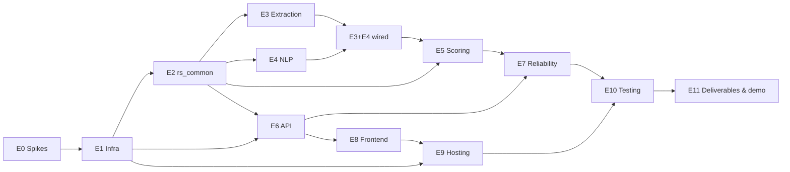

# Tasks — Execution Plan

> Turns `PRD.md` + `Architecture.md` + `Rules.md` + `Design.md` into ordered, verifiable work. Each epic maps to a phase handoff file that has the full build instructions for an agent or developer. Task IDs are stable; cite them in commits. "Done when" is the acceptance test. A task isn't done until it passes and the relevant rules (R-xx) are checked.

| Epic | Phase file | Owner (proposed) |
|---|---|---|
| E0 Pre-flight & spikes · E1 Infrastructure | `01-infrastructure-setup.md` | Parth |
| E2 Shared library · E3 Extraction · E4 NLP | `02-ingestion-pipeline.md` | Parth |
| E5 Scoring · E6 API · E7 Reliability & observability | `03-scoring-and-api.md` | Allen |
| E8 Frontend · E9 Hosting | `04-frontend-dashboard.md` | Tejesh |
| E10 Testing & hardening · E11 Deliverables & demo | `05-integration-testing-and-delivery.md` | Allen + Tejesh, Gaurav |

---

## Critical Path & Ordering

**Parallelism:** once E2 is done, E3/E4 (Parth), E5/E6 (Allen), and E8 against a mock API (Tejesh, using the `Architecture.md` §5.1 shapes) can proceed in parallel. Gaurav drafts E11 docs from the start.

**Start immediately (long lead times):** T-004 SES verification, T-005 quota check, T-001 Free-plan validation.

---

## E0 — Pre-flight & Spikes (de-risk before building)

| ID | Task | Depends | Done when |
|---|---|---|---|
| T-001 | Validate Free-plan availability of CloudFront, SES, ECR, SQS event source mappings, and AWS Budgets in the account (console + a trivial create/delete of each) | — | Written result in `infra/README.md`; any blocked service → new decision in `Memory.md` (A1) |
| T-002 | Pick CPU architecture and build path: confirm `sam build --use-container` works on the team's Macs with Docker Desktop; `x86_64` emulation OK | — | A hello-world x86_64 image and zip layer deploy and run (D-33) |
| T-003 | **Tesseract spike:** build a minimal extraction image on `public.ecr.aws/lambda/python:3.12` using `dnf`/`microdnf`; if Tesseract is unavailable, build the Debian `python:3.12-slim-bookworm` + `tesseract-ocr` + `awslambdaric` variant. Run `pytesseract.image_to_string` on a sample PNG inside Lambda | T-002 | Chosen base recorded as a D-34 outcome; image size and cold start noted |
| T-004 | Request SES sender identity verification + verify 3 test recipient addresses (ap-south-1); decide on production access (OQ5) | — | `verify` status = Success for all |
| T-005 | Check Lambda concurrent-execution quota (Service Quotas); request an increase to ≥50 if it's 10 | — | Quota recorded; `MaximumConcurrency` values confirmed or lowered (D-25) |
| T-006 | **spaCy layer spike:** build `NlpLayer` (spaCy + `en_core_web_sm` + dateutil) with `--use-container`; measure unzipped size and NLP cold start | T-002 | Size < 250 MB with the function, or decision to package NLP as an image (A4) |
| T-007 | Create synthetic fixture set: 12 resumes (4 native PDF, 3 scanned PDF, 1 mixed PDF, 2 DOCX, 1 PNG, 1 corrupt PDF) + 2 JDs + a labelled truth file (`tests/fixtures/truth.json`: name, skills, titles, years) | — | Fixtures committed; no real PII (R-PRIV-04) |
| T-008 | Resolve open questions OQ8–OQ11 with the mentor; record answers in `PRD.md` §13 | — | Each OQ has an answer or an accepted working assumption |
| T-009 | Create the deploy IAM user per `01` §3.9. Expect to add permissions iteratively: log each addition in `infra/README.md` | — | `sam deploy` of the E1 stack succeeds with this user |

## E1 — Infrastructure (`01-infrastructure-setup.md`)

| ID | Task | Depends | Done when |
|---|---|---|---|
| T-010 | Repo scaffold (layout per `Memory.md` §5), `.gitignore`, `ruff`/`black`/`pytest` config, `Makefile` targets (`build`, `deploy`, `test`, `lint`) | — | `make lint test` runs green on an empty suite |
| T-011 | `template.yaml`: Parameters (`EnvName`, `SesSenderAddress`, `AlertEmail`, `CreateBudget`, `BudgetAmountUsd`), Globals (python3.12, x86_64, JSON logging) | T-010 | `sam validate --lint` passes |
| T-012 | Upload bucket: BPA×4, SSE-S3, BucketOwnerEnforced, TLS-only policy, CORS (POST/GET from the CloudFront domain derived in-template; + localhost in dev), lifecycle (`exports/` 7 d, uploads 180 d) | T-011 | Console shows the settings; `aws s3api get-bucket-cors` matches |
| T-013 | Web bucket + CloudFront distribution with OAC, default root `index.html`, SPA 403/404 → `/index.html` (200), response-headers policy (HSTS, CSP, X-Content-Type-Options, frame-deny) | T-011, T-001 | Placeholder `index.html` served over HTTPS; direct S3 URL returns 403 |
| T-014 | DynamoDB: `jobs` (+`RecruiterJobsIndex`), `candidates` (**no GSI**), `failed_jobs` (TTL `expires_at`), `config` | T-011 | 4 tables, correct keys/indexes/TTL |
| T-015 | Config seed: custom resource or `scripts/seed-config.sh` writing `nlp_engine_mode=spacy_hybrid` | T-014 | Item present after deploy |
| T-016 | SQS: IngestionQueue (720 s, maxReceive 3), ScoringQueue (60 s, 5), both DLQs (14-day retention); queue policy allowing S3 `SendMessage` with `aws:SourceArn`/`aws:SourceAccount` | T-011 | Redrive policies linked |
| T-017 | Cognito: pool (`AllowAdminCreateUserOnly: true`, email sign-in), public client (SRP, no secret), groups `Recruiter`, `Admin` | T-011 | Admin-created test users in both groups + one groupless user can sign in |
| T-018 | SNS `AlertsTopic` (optional email subscription via the `AlertEmail` param); AWS Budget (monthly, OQ10) → SNS | T-011 | Budget visible |
| T-019 | Stub functions for all 14 handlers (501), `ExtractionFunction` as an image using the T-003 Dockerfile skeleton; explicit log groups (30 d); all Outputs | T-012..T-018 | `sam deploy` green; image function is package type Image; outputs printed |

## E2 — Shared Library `rs_common` (`02` §4–5)

| ID | Task | Depends | Done when |
|---|---|---|---|
| T-020 | `ddb.py`: `to_decimal`, `from_decimal` (recursive), `now_iso`, conditional-update helper that maps `ConditionalCheckFailedException` → a typed result | T-010 | Unit tests incl. nested lists/dicts, rounding |
| T-021 | `ids.py`, `clock.py` (injectable "now" for tests), `log.py` (JSON, PII-safe: rejects keys `text`, `email`, `name`) | T-010 | Unit tests |
| T-022 | `errors.py`: `TerminalError(code, stage)`, `TransientError(stage)`, the public `error_code` enum, stage enum | T-010 | Enums match `Architecture.md` §7.4 |
| T-023 | Data files: `skills_dictionary.json` (≥250), `job_titles_dictionary.json` (≥120), `synonyms.json`, **`title_families.json`** (≥15 families); a validation script (lowercase, no dupes, synonyms map to known terms, every family member is in the titles dictionary) | T-010 | Script passes in CI |
| T-024 | `normalization.py`: `normalize_skill`, `normalize_title`, `normalize_list` (dedupe+sort), `extract_email` (validated), `matcher_patterns()` = dictionary ∪ synonym keys | T-023 | Unit tests incl. `JS`, ` K8s `, duplicates |
| T-025 | `requirements.py`: `effective(job)`, `sources(job)`, `scorable(job)`, `blocking_reason(job)` | T-020 | Truth-table unit tests for all `parse_status` × confirmed × skills combinations |
| T-026 | `status.py`: `display_status(candidate, job, now)` + `sort_key` | T-025 | One unit test per row of `Architecture.md` §7.2 |
| T-027 | `scoring.py`: pure `score(candidate, job) -> ScoreResult` (sub-scores, match, matched/missing, title match, `scoring_version="v1"`) | T-024, T-025 | Tests: worked example = 71.3; exact / partial / zero overlap; no titles required; min_exp 0; unknown experience; over-qualified; Decimal inputs |
| T-028 | `authz.py`: `caller(event)` (sub, groups parsing tolerant of formats), `require_group`, `load_job_for_caller` (404 on not-owned) | T-020 | Tests incl. groupless, Admin, other-recruiter |
| T-029 | `http.py`: JSON response with CORS headers, error envelope, body schema validation helper; layer packaging (`python/rs_common`, `data/`) | T-022 | Layer builds; `import rs_common` works in a stub Lambda |

## E3 — Document Extraction (`02` §7)

| ID | Task | Depends | Done when |
|---|---|---|---|
| T-030 | Final Dockerfile (T-003 base) with pinned pypdf, PyMuPDF, python-docx, pytesseract, Pillow; Docker context `backend/` so the image copies `rs_common` (no layers for images) | T-003, T-022 | Image < 1 GB; `sam build` green |
| T-031 | Handler skeleton: parse SQS → S3 record, `unquote_plus`, `parse_key` (prefix, doc_type, ids; `.txt` only under `jd-uploads/`), `/tmp/{uuid}` + `finally` cleanup | T-030 | Unit tests on key parsing incl. encoded keys, bad prefixes |
| T-032 | `ingest_started_at` conditional write; missing placeholder → terminal (log + audit, no status write) | T-031 | Component test with moto |
| T-033 | Validation: size ≤10 MiB (HeadObject before download), magic bytes, page count ≤10 | T-031 | Tests for each rejection → correct `error_code`, no re-raise |
| T-034 | Extractors: PDF per-page native text + per-page OCR fallback (`file_type` native/scanned/mixed, `ocr_pages`), DOCX (paragraphs + tables), image OCR (`MAX_IMAGE_PIXELS`), TXT (UTF-8 with replacement) | T-033 | Fixtures from T-007 produce non-empty text; mixed PDF OCRs only its scanned page |
| T-035 | Usable-text check (<100 chars → terminal `unreadable_document`); text cap 100k with a `text_truncated` flag | T-034 | Blank scanned page fixture → terminal |
| T-036 | NLP invoke with `Config(read_timeout=40, retries 0)`; `FunctionError` → classify by `errorType` | T-034, T-040 | Forced `EmptyDocumentError` → terminal; forced `RuntimeError` → transient re-raise |
| T-037 | Failure recording: one `failed_jobs` row per failed attempt (`terminal`, `retry_count` = receive count, TTL, PII-free message); terminal status write with condition `parse_status <> parsed` | T-032 | Tests assert exactly one row per failure |
| T-038 | S3 → IngestionQueue notifications for both prefixes (in-template, after queue policy); `ScalingConfig.MaximumConcurrency: 3`; BatchSize 1 | T-031 | Upload of a fixture triggers the function |

## E4 — NLP (`02` §8)

| ID | Task | Depends | Done when |
|---|---|---|---|
| T-040 | `NlpLayer` build (T-006) + function config (1024 MB, 30 s, layers Common + Nlp); read `config` once at cold start, fail init on an unknown mode | T-006, T-029 | Cold start measured and logged |
| T-041 | Module-scope `nlp`, skill/title `PhraseMatcher`s built from `matcher_patterns()`; short-skill case rules (`go`, `r`, `c`, `sql`… list in data) | T-024 | Unit tests: "k8s" → kubernetes; "Go" in "go to market" not matched |
| T-042 | Entities: name = first PERSON in the first 5 non-empty lines, else first PERSON, else absent; employers = ORG deduped minus skill-normalizable (R-DATA-10); email via `extract_email` | T-041 | Truth-set name accuracy measured (SC3) |
| T-043 | Experience module (pure): section detection (Experience/Employment/Work History vs Education/Projects), range regex (`Mon YYYY`, `MM/YYYY`, `YYYY` ± `–—-to` ± `Present|Current|Till date|Now`), spaCy DATE as a supporting signal, interval merge, sanity filters, `computed/estimated/unknown` | T-020 | ≥15 unit cases incl. overlap, education, "2019 – Present", single-year ranges, no dates |
| T-044 | Resume write (conditional `attribute_exists`), enqueue `{reason: candidate_parsed}` | T-042, T-043 | Candidate item matches `Architecture.md` §6.2 |
| T-045 | JD write: `derived_*` only, `parse_status=parsed`; min-years regex fallback; fan-out: consistent Query of parsed candidates → `SendMessageBatch` in chunks of 10 (`reason: job_ready`) | T-044 | JD processed after resumes → all resumes enqueued |
| T-046 | Typed errors: raise `EmptyDocumentError` when the text has no tokens; never write `failed_jobs` | T-044 | Grep check: no `failed_jobs` in the NLP code |

## E5 — Scoring (`03` §3)

| ID | Task | Depends | Done when |
|---|---|---|---|
| T-050 | `scoreMatch` handler: consistent reads, not-parsed/not-scorable → ack + INFO log; `rs_common.scoring.score`; conditional write (`parse_status = parsed`) with explanation fields, `score_status=scored` | T-027 | Moto component tests for every branch |
| T-051 | Unexpected exception → `failed_jobs` `stage=scoring` → re-raise; ESM `MaximumConcurrency: 2` | T-050 | Forced failure → 5 attempts → DLQ |
| T-052 | `rs_common.fanout.enqueue_rescore(job_id, reason)` shared by NLP (T-045) and `updateJob` (T-064) | T-050 | Single implementation used in both places |

## E6 — API (`03` §4–6)

| ID | Task | Depends | Done when |
|---|---|---|---|
| T-060 | `RecruiterApi`: Cognito authorizer default, `AddDefaultAuthorizerToCorsPreflight: false`, CORS (origin derived from the distribution), GatewayResponses DEFAULT_4XX/5XX with CORS headers, stage throttling 20/40, access logging | T-019 | curl preflight 200 without a token; a 401 response has CORS headers |
| T-061 | `createJobPosting`: schema validation (R-VAL-01..03, 09), normalization, job + placeholders (BatchWrite), `jd.txt` write for text JDs, presigned POSTs with conditions | T-028, T-029 | Contract tests; uploading > 10 MiB via the returned POST fails at S3 |
| T-062 | `addResumes`: ownership, per-job cap 200, placeholders + POSTs | T-061 | Recruiter B → 404 |
| T-063 | `getJobs` (GSI Query, Admin Scan, `next_token` as base64 `LastEvaluatedKey`), `getJob` (effective/sources/derived/blocking_reason) | T-025, T-028 | Admin sees owner column data |
| T-064 | `updateJob`: validation, write explicit fields, `requirements_confirmed=true`, recompute `shortlist_candidate` implicitly via rescore fan-out; returns `rescore_enqueued` | T-052 | Decisions unchanged after PATCH (R-BUS-05) |
| T-065 | `getCandidatesByJob`: paginated base Query, `display_status`, sort, response mapping (`recommended`, `experience_basis`, `title_match`) | T-026 | Pending/error/unscored rows all returned |
| T-066 | `updateCandidateDecision`: conditional on `score_status=scored`, notification claim, SES send with env sender, greeting fallback, `notification_status` in response | T-004 | Shortlist→reject→shortlist sends exactly one email (SC6) |
| T-067 | `exportShortlistCsv`: Query + filter, CSV with formula escaping, `exports/{job}/{ts}.csv`, presigned GET 5 min, `row_count` | T-065 | Cell `=HYPERLINK(...)` exported as `'=HYPERLINK(...)` |
| T-068 | `getFailedJobs`: Admin check, `job_id` Query or paginated Scan, newest first within page | T-028 | Recruiter → 403 |
| T-069 | `getResumeUrl` (S priority, gated on OQ8) | T-028 | 60 s URL; other recruiter → 404 |

## E7 — Reliability & Observability (`03` §7–8)

| ID | Task | Depends | Done when |
|---|---|---|---|
| T-070 | `dlqHandler`: both DLQs, id extraction (decoded keys), terminal row with `raw_payload`, conditional status write (`parse_status`/`score_status`), EMF `TerminalFailures` | T-037, T-051 | Redelivered DLQ message produces no status regression |
| T-071 | Alarms per `Architecture.md` §11.5 → SNS | T-070 | Forced terminal failure → alarm email within 5 min |
| T-072 | Structured logging audit: every handler logs `stage`, ids, `duration_ms`; grep test for forbidden fields | T-021 | CI check passes |
| T-073 | `infra/README.md` runbook: deploy, seed, users/groups, SES, replay procedure (`Architecture.md` §11.6), teardown | T-070 | A new teammate deploys `dev` from the README alone |

## E8 — Frontend (`04-frontend-dashboard.md`)

| ID | Task | Depends | Done when |
|---|---|---|---|
| T-080 | Vite + React Router scaffold, `config.js` fail-fast, tokens/base CSS, layout (TopBar, PageHeader, Toast, ConfirmDialog, Drawer, Modal) | — | Lint + build green |
| T-081 | Auth: Amplify config, `AuthContext` (user, groups, signIn incl. NEW_PASSWORD_REQUIRED, signOut), `ProtectedRoute`, `AdminRoute`, no-group page | T-017 | Groupless user sees NoAccessPage |
| T-082 | `api/client.js` (error envelope → `ApiError`, 401 refresh-retry) + mock adapter for development before E6 | — | Pages run against mocks |
| T-083 | `upload.js` presigned-POST uploader (XHR progress, pool of 4, one auto-retry, expiry detection) + `useUploadQueue` | T-082 | Unit tests with a fake XHR |
| T-084 | Job list page + JobStatusBadge + pagination | T-082 | Empty state and list render |
| T-085 | Create job page: 3 sections, ChipInput, FileDropZone with validation, submit gating, progress panel, `beforeunload` | T-083 | Invalid files excluded with reasons |
| T-086 | Job detail: header, banner, RequirementsPanel, SummaryStrip, CandidateTable, StatusCell, ScoreCell, ScoreBreakdown, ExperienceCell, SkillTagList | T-082 | All 9 display states render from mock data |
| T-087 | `usePolling` (5 s, visibility, backoff, 30 min cap, merge by id, hover-deferred resort) | T-086 | Polling stops when all rows are terminal |
| T-088 | DecisionControl + shortlist ConfirmDialog + NotificationChip + optimistic rollback; ExportButton | T-086 | 409 rolls back with a toast |
| T-089 | RequirementsEditor drawer (PATCH), AddResumesModal / Re-upload, FailedJobsPage + StageLegend, NotFound | T-085, T-086 | E2E flows in §E10 pass |

## E9 — Hosting & Release (`04` §7)

| ID | Task | Depends | Done when |
|---|---|---|---|
| T-090 | `scripts/gen-frontend-env.sh <env>` from stack outputs | T-019 | `.env.dev` generated, not committed |
| T-091 | `scripts/deploy-frontend.sh <env>`: build, sync with cache headers, CloudFront invalidation | T-013 | Fresh deploy visible within 2 min |
| T-092 | Verify CORS end to end: the origin is derived from the distribution in-template, so no manual step. Check preflight, a 401 with CORS headers, and a browser upload from the CloudFront URL | T-091 | Browser upload + API calls succeed from the CloudFront URL |

## E10 — Testing & Hardening (`05-integration-testing-and-delivery.md`)

| ID | Task | Depends | Done when |
|---|---|---|---|
| T-100 | Unit test gate: `rs_common` ≥ 90% line coverage; experience + scoring suites | E2 | CI green |
| T-101 | Component tests (moto) for every handler's branches; extraction tested locally via `sam local invoke` with fixtures | E3–E7 | CI green |
| T-102 | Integration test script `tests/integration/run.py <env>`: creates a job via the API with a test user token, uploads the T-007 fixtures, polls until terminal, asserts statuses/scores/one email | E7, E6 | SC1 passes on `dev` |
| T-103 | Failure-path tests: unsupported (renamed), corrupt PDF, blank scan, 11-page PDF, JD-after-resumes, JD failure → PATCH, forced scoring failure, duplicate S3 event, never-uploaded file → `upload_missing` | T-102 | Each ends in the documented state (SC4) |
| T-104 | Security tests: no token (401 + CORS), groupless (403), cross-recruiter (404 on every job route), Recruiter on `/failed-jobs` (403), oversized POST rejected, public-access checks on both buckets, CSV injection, log grep for PII, IAM policy review against the `Architecture.md` §8.1 matrix, `grep -ri "textract\|comprehend" backend/` empty | T-102 | Checklist signed off (SC5) |
| T-105 | Quality evaluation: run all fixtures, compare with `truth.json`, compute SC3 metrics; record in `docs/evaluation.md` | T-102 | Metrics recorded; misses analysed → dictionary updates |
| T-106 | Load test: 50 resumes in one job; record time-to-terminal, throttles, DLQ count | T-102 | NFR-SCALE-1 measured; `MaximumConcurrency` tuned |
| T-107 | Accessibility pass: keyboard walkthrough, axe DevTools on 5 screens, contrast check | E8 | No serious/critical axe issues |

## E11 — Deliverables & Demo

| ID | Task | Depends | Done when |
|---|---|---|---|
| T-110 | `docs/sample-nlp-output/{native_pdf,scanned_pdf,docx}.json` from real runs (extracted text + entities + method per field) | T-102 | Three files, generated by a script, not hand-edited |
| T-111 | `docs/deliverables.md`: matching logic (with the corrected title/experience rules), extraction/NLP architecture + honesty table, 3 enhancements, PyMuPDF AGPL note, known limitations | T-105 | Mentor-readable |
| T-112 | Demo script (`docs/demo.md`): 4 upload paths, a JD-after-resumes moment, breakdown, shortlist email, requirements edit → rescore, export, Admin failures | T-103 | Dry run completed live once (SC-DoD) |
| T-113 | Sync all docs with any late decisions (new `Memory.md` §3 entries, D-34 outcome, final concurrency); update the status | all | No doc contradicts `Memory.md` §3 |

---

## Definition of Done (project)

- [ ] Every task above is done, or explicitly deferred with a decision entry
- [ ] SC1–SC7 (`PRD.md` §9) pass on `dev`, and the demo runs on the target stack
- [ ] All "never violate" rules (`Rules.md` §10) verified by T-104 and code review
- [ ] No candidate or job reaches a state not in `Architecture.md` §7.2
- [ ] `infra/README.md` lets a new teammate deploy from zero
- [ ] Deliverables T-110–T-112 complete

**Per-task DoD:** code + tests merged; lint green; rule IDs cited where enforced; no TODOs without a task ID; docs updated if behaviour changed.

## Future Enhancements (post-MVP, not scheduled)

| ID | Enhancement | Builds on |
|---|---|---|
| F1 | Custom spaCy NER for `SKILL` / `JOB_TITLE`, trained on labelled resumes; replaces the dictionaries for detection (keep normalization) | T-105 evaluation data; D-09 table update |
| F2 | Cover-letter sentiment as a soft signal, never in the score | Separate field + UI chip |
| F3 | Blind screening mode + shortlist-rate parity dashboard | D-46 already keeps identity out of scoring |
| F4 | Textract/Comprehend migration if the account is upgraded (`nlp_engine_mode` second value) | D-02, D-13 seam |
| F5 | Duplicate-resume detection (content SHA-256 per job) | `candidates` attribute + UI badge |
| F6 | Self-service password reset, recruiter invite flow | Cognito hosted flows |
| F7 | Job/candidate deletion with S3 cleanup (retention/erasure requests) | OQ9 |
| F8 | Semantic skill matching (embeddings) to catch out-of-dictionary skills | Would need the container NLP image |
